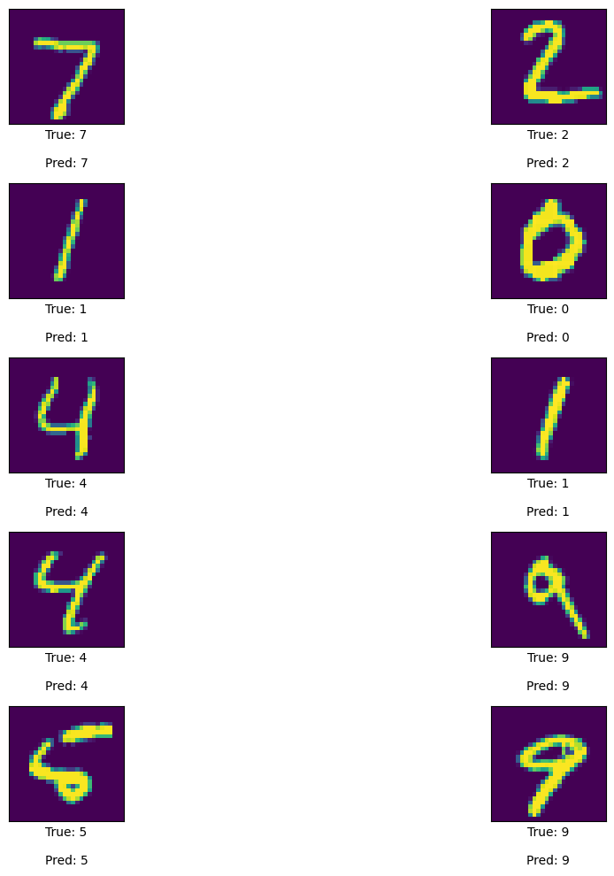

# MNIST Classification

This project demonstrates the use of a Convolutional Neural Network (CNN) to classify handwritten digits from the MNIST dataset.

## Introduction

The MNIST dataset is a large database of handwritten digits that is commonly used for training various image processing systems. The dataset has a training set of 60,000 examples and a test set of 10,000 examples.

## Requirements

- Python 3.x
- TensorFlow
- Keras
- NumPy
- Matplotlib
- Seaborn
  
## Data
### Sample Data


### Number of Elements per Class


## Data Preparation

```python
import tensorflow as tf
from tensorflow.keras.datasets import mnist

# Load the dataset
(x_train, y_train), (x_test, y_test) = mnist.load_data()

# Normalize the data
x_train = x_train / 255.0
x_test = x_test / 255.0

X_train = np.expand_dims(X_train, -1)
X_test = np.expand_dims(X_test, -1)
```

## Model Architecture

```python
from tensorflow.keras.models import Sequential
from tensorflow.keras.layers import Dense, Flatten, Conv2D, MaxPooling2D

# Define the model
model= Sequential()
model.add(Conv2D(32, (3,3), activation='relu', input_shape=(28,28,1)))
model.add(MaxPool2D((2,2)))
model.add(Conv2D(64,(3,3),activation='relu'))
model.add(MaxPool2D((2,2)))
model.add(Flatten())
model.add(Dense(128, activation='relu'))
model.add(Dropout(0.6))
model.add(Dense(10, activation='softmax'))
```

## Compilation and Training

```python
# Compile the model
model.compile(optimizer='adam', loss='sparse_categorical_crossentropy', metrics=['accuracy'])

# Train the model
history = model.fit(x_train, y_train, epochs=20, validation_split=0.2,batch_size = 64)
```

## Evaluation

```python
# Evaluate the model
test_loss, test_acc = model.evaluate(x_test, y_test)
print("Test loss:", score[0])
print("Test accuracy:", score[1])
```
**Test loss** : `0.030290957540273666`

**Test accuracy** : `0.9932000041007996`

## Results

After training, the model achieves an accuracy of approximately `99,17%` on the validation dataset.

### Model Accuracy


### Model Loss


### Predictions




## Conclusion

This project showcases a basic implementation of a CNN for digit classification using the MNIST dataset. Further improvements can be made by experimenting with different architectures and hyperparameters.

### Instructions to Use

1. **Clone the repository**: 
    ```sh
    git clone https://github.com/aaudric/MNIST.git
    ```

2. **Navigate to the project directory**:
    ```sh
    cd MNIST
    ```

3. **Install the required packages**:
    ```sh
    pip install tensorflow keras numpy matplotlib seaborn
    ```

4. **Run the notebook**:
    Open the `mnist.ipynb` notebook and execute the cells to train and evaluate the model.

